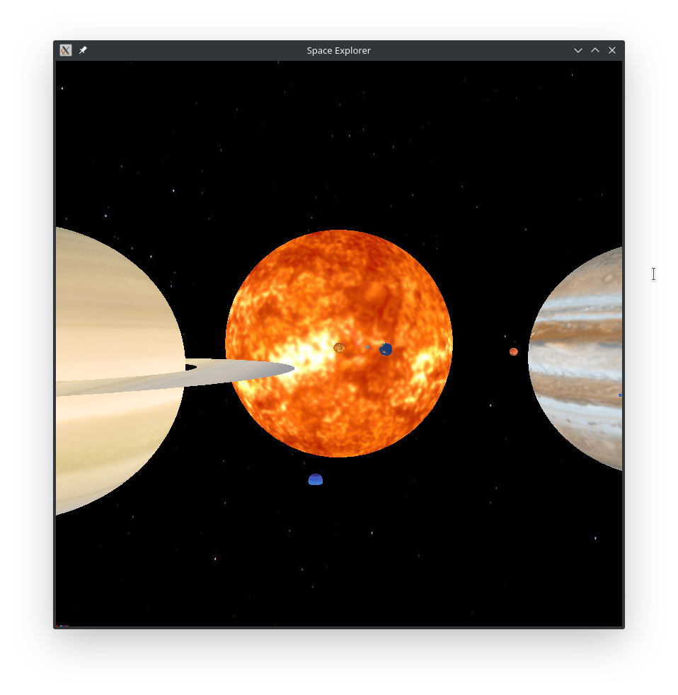

# Space Explorer

Projekat radjen u sklopu kursa Racunarska grafika na Matematickom fakultetu u Beogradu.
Space Explorer je simulacija u kojoj ste vi u ulozi svemirskog broda koji ima zadatak da pronadje resurse koje se nalaze negde u svemiru.
Odnos velicina planeta je dobar osim Sunca koje bi trebalo da bude 3+ puta vece ali je zbog velicine scene ostavljeno ovako. Takodje, udaljenost planeta od Sunca je stavljeno nasumicno, opet zbog velicine scene. Rotacija i revolucija planeta je napravljeno po podacima sa wikipedie. 



## Pokretanje

Projekat je radjen u programskom jeziku C, koriscenjem grafickog sistema OpenGL kao i biblioteke GLUT. Potrebno je da na vasem racunaru imate instalirane potrebne biblioteke. Za Ubuntu distribuciju:

```bash
sudo apt-get install binutils-gold freeglut3 freeglut3-dev
```

Nakon sto preuzmete kod sa github-a potrebno je da ga raspakujete i pozicionirate se u datoteku gde se nalazi program. Zatim uradite sledece komande:

```bash
make
./space_explorer
```
i igra ce se pokrenuti.

## Komande

| **Komanda** | **Opis** |
| :---  | :--- |
| `G` | Pokretanje igre |
| `↑` `↓` | Kretanje gore/dole|
| `←` `→` | Kretanje levo/desno |
| `A` `B`  | Pomeranje kamere levo/desno |
| `S` | Zaustavljanje igre |
| `1` `2` `3` | Promena brzine simulacije |
| `ESC` | Kraj programa |

## Uputstvo za igranje
Potrebno je pronaci tri resursa koji se nalaze negde u svemiru. Nakon sto ih pronadjete izaci ce vam odgovarajuca poruka.   
POMOC: Prvi resurs je odmah izmedju letelice i Jupitera, sledeci se nalazi u blizini pocetnih koordinata Zemlje i poslednji se nalazi u blizini Neptuna.   
Ne idite previse blizu Suncu.

## Autor
Djordje Vujinovic 481/17